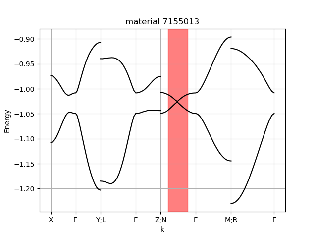

# Online Search Tool for Graphical Patterns in Electronic Band Structures

This repository hosts the code and a test case for the paper [arXiv:1710.11611](https://arxiv.org/abs/1710.11611). Tested with Python 3.6.5.

To see the tool in action, register for free at: [omdb.diracmaterials.org](https://omdb.diracmaterials.org)

## Installation
```
pip install -r requirements.txt
```

## Example
This repository contains a data folder with a VASP calculation. You can add more calculations here, each folder should contain calculations for a single material.

Create an ANN (approximate nearest neighbours) index:
```
python create_index.py --dataset folder --band_index -1 --width 0.4 --dimensions 16 --trees 10
```

Perform the search for a crossing/node:
```
python search.py --band_index -1 --width 0.4 --dimensions 16
```

The search script prints the angular distance and the following plot should appear:



## Test
TODO
